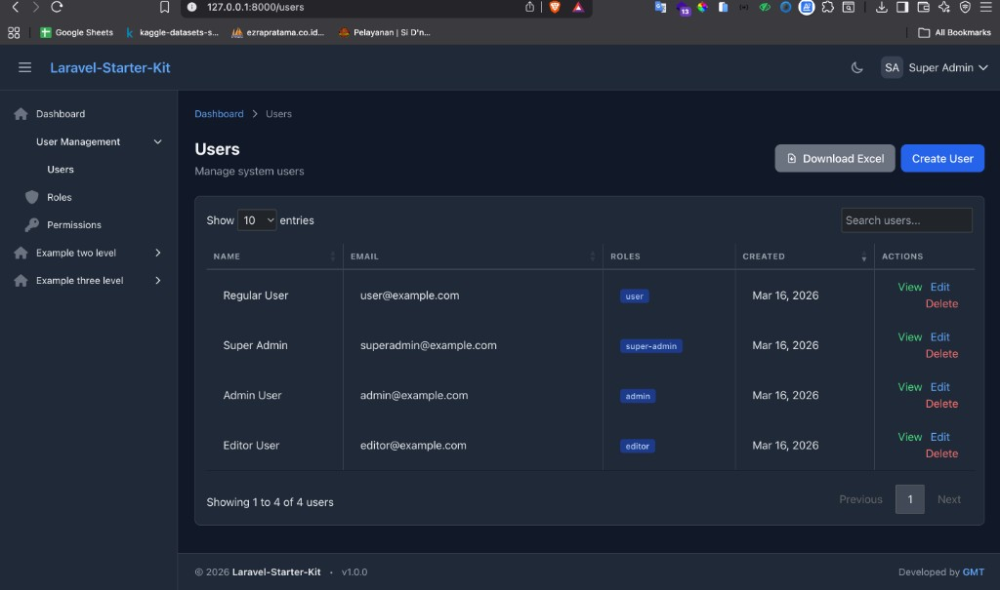
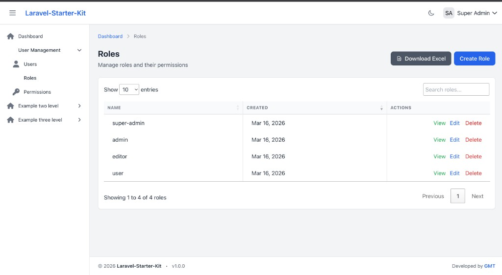
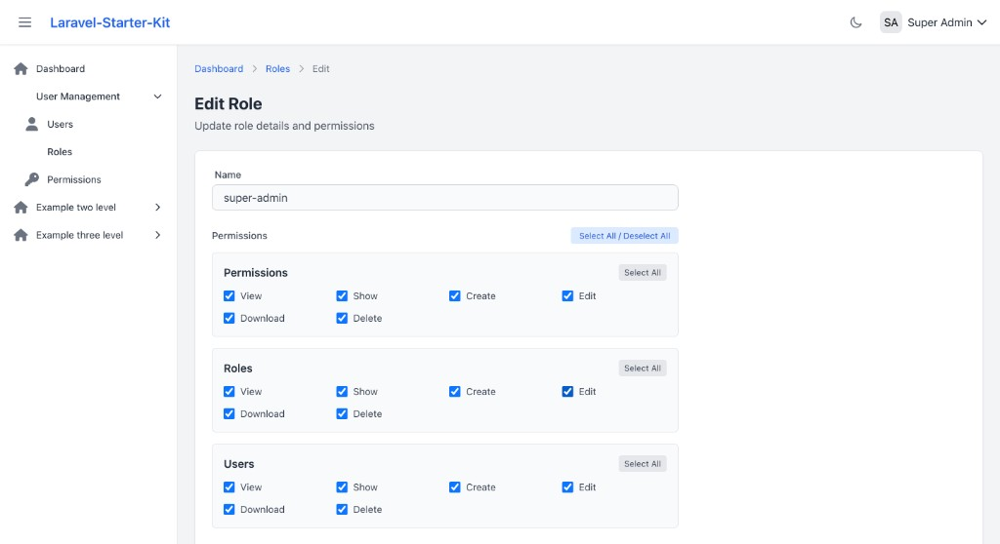
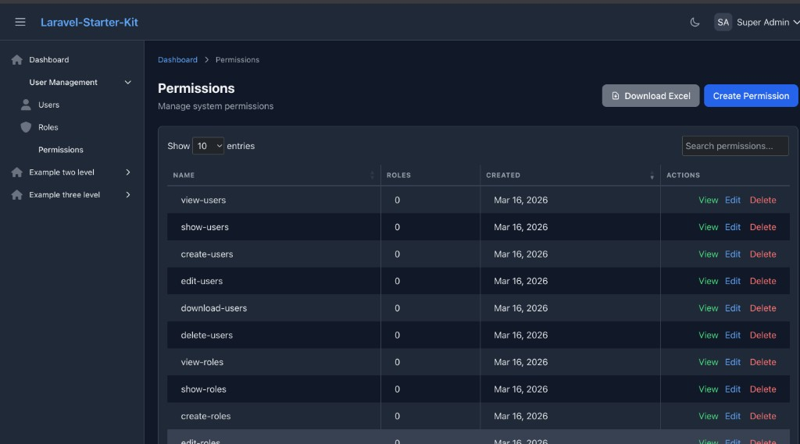

# Screenshots Guide

This document provides detailed screenshots of all RBAC features in the Laravel Starter Kit.

---

## User Management

### Users List View

**Features shown:**
- DataTables with server-side processing
- Real-time search functionality
- Role badges showing each user's assigned roles
- Export to Excel button
- Action buttons (View, Edit, Delete) with permission checks
- Pagination controls (10, 25, 50, 100 entries per page)
- Alternating row colors (zebra striping) for better readability
- Dark mode support

**Permissions required:**
- `view-users` - To access this page
- `show-users` - To see the View button
- `edit-users` - To see the Edit button
- `delete-users` - To see the Delete button
- `download-users` - To see the Download Excel button

---

## Role Management

### Roles List View

**Features shown:**
- Clean table layout with DataTables
- Server-side pagination and search
- Export to Excel functionality
- Created date for each role
- Permission-based action buttons
- Responsive design with mobile support

**Permissions required:**
- `view-roles` - To access this page
- `show-roles` - To see the View button
- `edit-roles` - To see the Edit button
- `delete-roles` - To see the Delete button
- `download-roles` - To see the Download Excel button

### Edit Role - Grouped Permissions

**Features shown:**
- Permission checkboxes grouped by resource (Users, Roles, Permissions)
- Permissions ordered logically (View → Show → Create → Edit → Download → Delete)
- "Select All" button for global selection
- "Select All" per group for quick assignment
- Clean, organized layout for easy permission management
- Breadcrumb navigation
- Light/Dark mode toggle

**Permission groups:**
1. **Permissions** - Manage system permissions
   - View, Show, Create, Edit, Download, Delete
2. **Roles** - Manage roles
   - View, Show, Create, Edit, Download, Delete
3. **Users** - Manage users
   - View, Show, Create, Edit, Download, Delete

---

## Permission Management

### Permissions List View

**Features shown:**
- Simple, clean permission listing
- DataTables with search and pagination
- Export to Excel/CSV
- Permission naming convention: `action-resource` (e.g., view-users, create-roles)
- Consistent UI with other CRUD pages

**Permissions required:**
- `view-permissions` - To access this page
- `show-permissions` - To see the View button
- `edit-permissions` - To see the Edit button
- `delete-permissions` - To see the Delete button
- `download-permissions` - To see the Download Excel button

---

## Permission Types

All resources follow the same permission structure:

1. **view-{resource}** - View list/index page
2. **show-{resource}** - View single record details (read-only)
3. **create-{resource}** - Create new records
4. **edit-{resource}** - Edit existing records
5. **download-{resource}** - Export to Excel/CSV
6. **delete-{resource}** - Delete records

---

## DataTables Features

All listing pages include:

- ✅ Server-side processing for optimal performance
- ✅ Real-time search
- ✅ Column sorting
- ✅ Pagination (10, 25, 50, 100 per page)
- ✅ Row striping (alternating colors)
- ✅ Responsive design
- ✅ Dark mode support
- ✅ Export to Excel/CSV
- ✅ Custom Tailwind styling
- ✅ No NPM/Vite required (CDN-based)

---

## UI/UX Features

### Consistent Design Patterns

- Clean, minimal LaravelDaily style
- Card-based layouts
- Breadcrumb navigation
- Responsive tables
- Permission-based button visibility
- Success/error message notifications
- FontAwesome icons
- Hover effects on rows

### Dark Mode Support

All pages support dark mode:
- Automatic color scheme switching
- Preserved readability
- Consistent styling across all components

### Mobile Responsive

- Stacked layout on mobile devices
- Touch-friendly buttons
- Collapsible sidebar
- Responsive tables

---

## Export Functionality

### Excel/CSV Export

Each listing page has an export button that:
- Exports all records (not just current page)
- Includes all relevant data
- Formats dates properly
- Works with filtered/searched data
- Downloads as `.xlsx` format
- Filename includes date: `users-2026-03-17.xlsx`

**Export Files Include:**
- **Users:** Name, Email, Roles, Created Date
- **Roles:** Name, Created Date
- **Permissions:** Name, Created Date

---

## Performance Optimizations

### Why We Removed Count Columns

Initially, we had count columns (e.g., "Users" count in Roles, "Roles" count in Permissions), but we removed them for:

1. **Better Performance** - No `withCount()` queries
2. **Faster Load Times** - Simpler queries, smaller JSON payload
3. **Scalability** - Works well with large datasets
4. **Reduced DB Load** - Fewer aggregate queries

If you need count information, click the "View" button to see full details on the show page!

---

## Browser Compatibility

Tested and working on:
- ✅ Chrome/Edge (latest)
- ✅ Firefox (latest)
- ✅ Safari (latest)
- ✅ Mobile browsers (iOS Safari, Chrome Mobile)

---

## Technologies Used

### Backend
- Laravel 12
- Laravel Sanctum (API auth)
- Yajra DataTables
- Maatwebsite Excel

### Frontend (CDN)
- Tailwind CSS 3.x
- Alpine.js 3.x
- jQuery 3.7
- DataTables 1.13.7
- Font Awesome 6.x

---

## Next Steps

To see these features in action:
1. Run `php artisan migrate --force`
2. Run `php artisan db:seed --class=RolePermissionSeeder --force`
3. Login with: superadmin@example.com / password
4. Navigate to User Management → Users/Roles/Permissions

For more information, see:
- [RBAC_API_GUIDE.md](RBAC_API_GUIDE.md)
- [UI_GUIDE.md](UI_GUIDE.md)
- [QUICK_REFERENCE.md](QUICK_REFERENCE.md)
